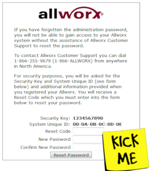

# Alldorx
Allworx "Reset Code" generator

On Allworx 6x servers, the "Allworx System Administration" page provides a "Lost Password" link that allows you to reset the admin user's password.  This link takes you to the device's "lostPass.asp" form.  This form requires a "Reset Code" to be entered, which is usually obtained by contacting technical support or the authorized reseller who sold you the equipment.  If you have inherited an Allworx server and do not have the registration information you can use this script to generate the "Reset Code" needed to change the admin password.

This script resides under a protected repository in my BitBucket.

https://bitbucket.org/billchaison/alldorx
